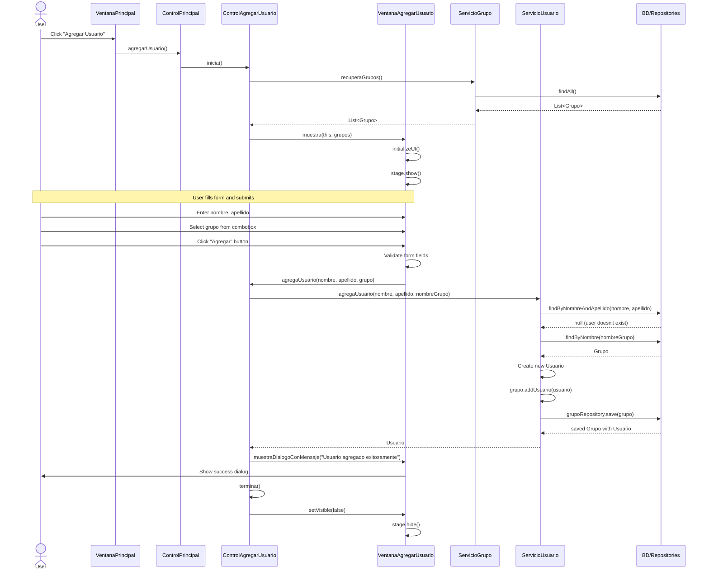

# Sequence Diagram: Agregar Usuario Flow

Este diagrama de secuencia ilustra el flujo de interacciones que ocurren cuando un usuario hace clic en el botón "Agregar Usuario" en la aplicación.

## Explicación de la Secuencia

1. **Interacción del Usuario y Flujo Inicial**:
   - El usuario hace clic en el botón "Agregar Usuario" en la ventana principal
   - La solicitud fluye desde VentanaPrincipal → ControlPrincipal → ControlAgregarUsuario
   - ControlAgregarUsuario recupera la lista de grupos de ServicioGrupo
   - VentanaAgregarUsuario se inicializa y muestra el formulario al usuario

2. **Envío y Procesamiento del Formulario**:
   - El usuario ingresa información y hace clic en el botón "Agregar"
   - VentanaAgregarUsuario valida los campos del formulario
   - Si son válidos, llama a ControlAgregarUsuario.agregaUsuario() con los datos del formulario

3. **Lógica de Negocio y Persistencia de Datos**:
   - ServicioUsuario verifica si el usuario ya existe
   - Recupera el grupo seleccionado
   - Crea un nuevo usuario y lo agrega al grupo
   - Guarda el grupo actualizado en la base de datos

4. **Confirmación y Finalización**:
   - Se muestra un mensaje de éxito al usuario
   - La ventana se cierra y el control regresa a la ventana principal de la aplicación 