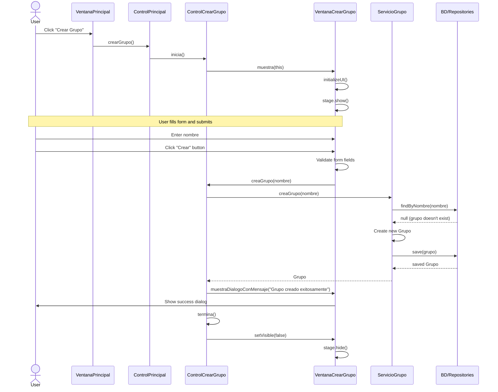

# Sequence Diagram: Crear Grupo Flow

Este diagrama de secuencia ilustra el flujo de interacciones que ocurren cuando un usuario hace clic en el botón "Crear Grupo" en la aplicación.

## Explicación de la Secuencia

1. **Interacción del Usuario y Flujo Inicial**:
   - El usuario hace clic en el botón "Crear Grupo" en la ventana principal
   - La solicitud fluye desde VentanaPrincipal → ControlPrincipal → ControlCrearGrupo
   - VentanaCrearGrupo se inicializa y muestra el formulario al usuario

2. **Envío y Procesamiento del Formulario**:
   - El usuario ingresa el nombre del grupo y hace clic en el botón "Crear"
   - VentanaCrearGrupo valida el campo del formulario
   - Si es válido, llama a ControlCrearGrupo.creaGrupo() con el nombre del grupo

3. **Lógica de Negocio y Persistencia de Datos**:
   - ServicioGrupo verifica si el grupo ya existe
   - Si no existe, crea un nuevo grupo
   - Guarda el nuevo grupo en la base de datos

4. **Confirmación y Finalización**:
   - Se muestra un mensaje de éxito al usuario
   - La ventana se cierra y el control regresa a la ventana principal de la aplicación 