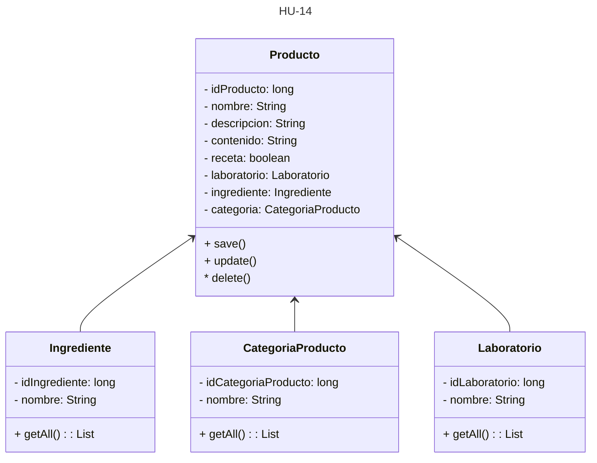

# HU-14 Modelo de dominio

```mermaid
---
title: HU-14
---
classDiagram
    Producto <-- Ingrediente
    Producto <-- CategoriaProducto
    Producto <-- Laboratorio

    
    class Producto{
        - idProducto: long
        - nombre: String 
        - descripcion: String 
        - contenido: String 
        - receta: boolean 
        - laboratorio: Laboratorio 
        - ingrediente: Ingrediente 
        - categoria: CategoriaProducto 
        + save()
        + update()
        * delete()
    }
    class Ingrediente{
        - idIngrediente: long 
        - nombre: String 
        + getAll(): List<Ingrediente>
    }
    class Laboratorio{
        - idLaboratorio: long 
        - nombre: String 
        + getAll(): List<Laboratorio>
    }
    class CategoriaProducto{
        - idCategoriaProducto: long 
        - nombre: String 
        + getAll(): List<CategoriaProducto>

    }


``` 
