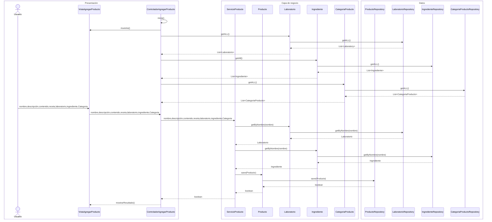
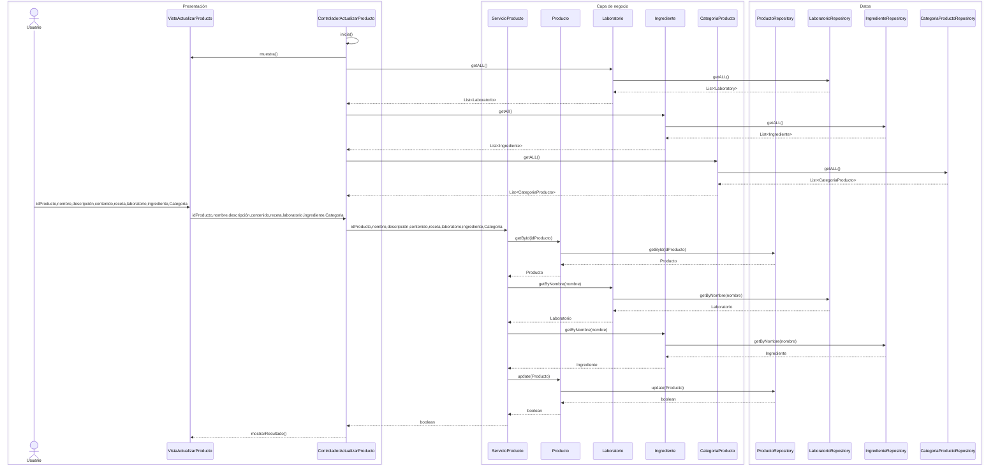
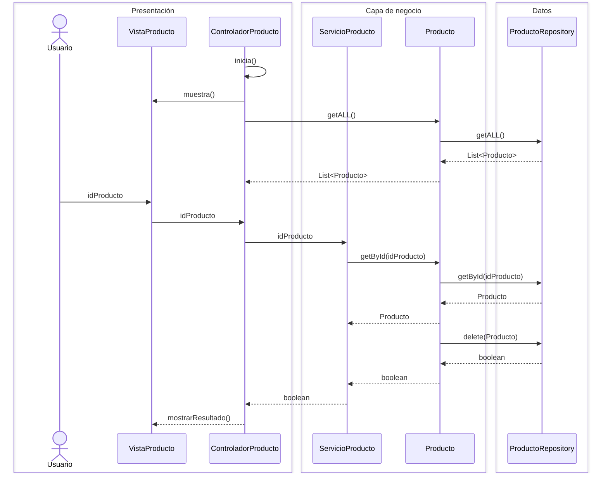

# Secuencias HU-14

## Registrar Producto

```mermaid
    sequenceDiagram
    box Presentación
    actor U as Usuario
    Participant V as VistaAgregarProducto
    Participant C as ControladorAgregarProducto
    end
    box Capa de negocio
    Participant S as ServicioProducto
    Participant P as Producto
    Participant L as Laboratorio
    Participant I as Ingrediente
    Participant CP as CategoriaProducto
    end 
    box Datos
    Participant R as ProductoRepository
    Participant Lr as LaboratorioRepository
    Participant Ir as IngredienteRepository
    Participant Cr as CategoriaProductoRepository
    end

    C->>C: inicia()
    C ->> V: muestra()
    C ->> L: getALL()
    L ->> Lr: getALL()
    Lr -->> L: List<Laboratory>
    L -->> C: List<Laboratorio>
    C ->> I: getAll()
    I ->> Ir: getALL()
    Ir -->> I: List<Ingrediente>
    I -->> C: List<Ingrediente>
    C ->> CP: getALL()
    CP ->> Cr: getALL()
    Cr -->> CP: List<CategoriaProducto>
    CP -->> C: List<CategoriaProducto>
    U ->> V: nombre,descripción,contenido,receta,laboratorio,ingrediente,Categoria
    V ->> C: nombre,descripción,contenido,receta,laboratorio,ingrediente,Categoria
    C ->> S: nombre,descripción,contenido,receta,laboratorio,ingrediente,Categoria
    S ->> L: getByNombre(nombre)
    L ->> Lr: getByNombre(nombre)
    Lr -->> L: Laboratorio
    L -->> S: Laboratorio
    S ->> I: getByNombre(nombre)
    I ->> Ir: getByNombre(nombre)
    Ir -->> I: Ingrediente
    I -->> S: Ingrediente
    S ->> P: save(Producto)
    P ->> R: save(Producto)
    R -->> P: boolean
    P -->> S: boolean
    S -->> C: boolean
    C -->> V: mostrarResultado()
```
## Actualizar Producto

```mermaid
    sequenceDiagram
    box Presentación
    actor U as Usuario
    Participant V as VistaActualizarProducto
    Participant C as ControladorActualizarProducto
    end
    box Capa de negocio
    Participant S as ServicioProducto
    Participant P as Producto
    Participant L as Laboratorio
    Participant I as Ingrediente
    Participant CP as CategoriaProducto
    end 
    box Datos
    Participant R as ProductoRepository
    Participant Lr as LaboratorioRepository
    Participant Ir as IngredienteRepository
    Participant Cr as CategoriaProductoRepository
    end

    C->>C: inicia()
    C ->> V: muestra()
    C ->> L: getALL()
    L ->> Lr: getALL()
    Lr -->> L: List<Laboratory>
    L -->> C: List<Laboratorio>
    C ->> I: getAll()
    I ->> Ir: getALL()
    Ir -->> I: List<Ingrediente>
    I -->> C: List<Ingrediente>
    C ->> CP: getALL()
    CP ->> Cr: getALL()
    Cr -->> CP: List<CategoriaProducto>
    CP -->> C: List<CategoriaProducto>
    U ->> V: idProducto,nombre,descripción,contenido,receta,laboratorio,ingrediente,Categoria
    V ->> C: idProducto,nombre,descripción,contenido,receta,laboratorio,ingrediente,Categoria
    C ->> S: idProducto,nombre,descripción,contenido,receta,laboratorio,ingrediente,Categoria
    S ->> P: getById(idProducto)
    P ->> R: getById(idProducto)
    R-->> P: Producto
    P-->> S: Producto
    S ->> L: getByNombre(nombre)
    L ->> Lr: getByNombre(nombre)
    Lr -->> L: Laboratorio
    L -->> S: Laboratorio
    S ->> I: getByNombre(nombre)
    I ->> Ir: getByNombre(nombre)
    Ir -->> I: Ingrediente
    I -->> S: Ingrediente
    S ->> P: update(Producto)
    P ->> R: update(Producto)
    R -->> P: boolean
    P -->> S: boolean
    S -->> C: boolean
    C -->> V: mostrarResultado()
```
## Borrar Producto

```mermaid
    sequenceDiagram
    box Presentación
    actor U as Usuario
    Participant V as VistaProducto
    Participant C as ControladorProducto
    end
    box Capa de negocio
    Participant S as ServicioProducto
    Participant P as Producto
    end 
    box Datos
    Participant R as ProductoRepository
    end

    C->>C: inicia()
    C ->> V: muestra()
    C ->> P: getALL()
    P ->> R: getALL()
    R -->> P: List<Producto>
    P -->> C: List<Producto>
    U ->> V: idProducto
    V ->> C: idProducto
    C ->> S: idProducto
    S ->> P: getById(idProducto)
    P ->> R: getById(idProducto)
    R -->> P: Producto
    P -->> S: Producto
    P ->> R: delete(Producto)
    R -->> P: boolean
    P -->> S: boolean
    S -->> C: boolean
    C -->> V: mostrarResultado()
```