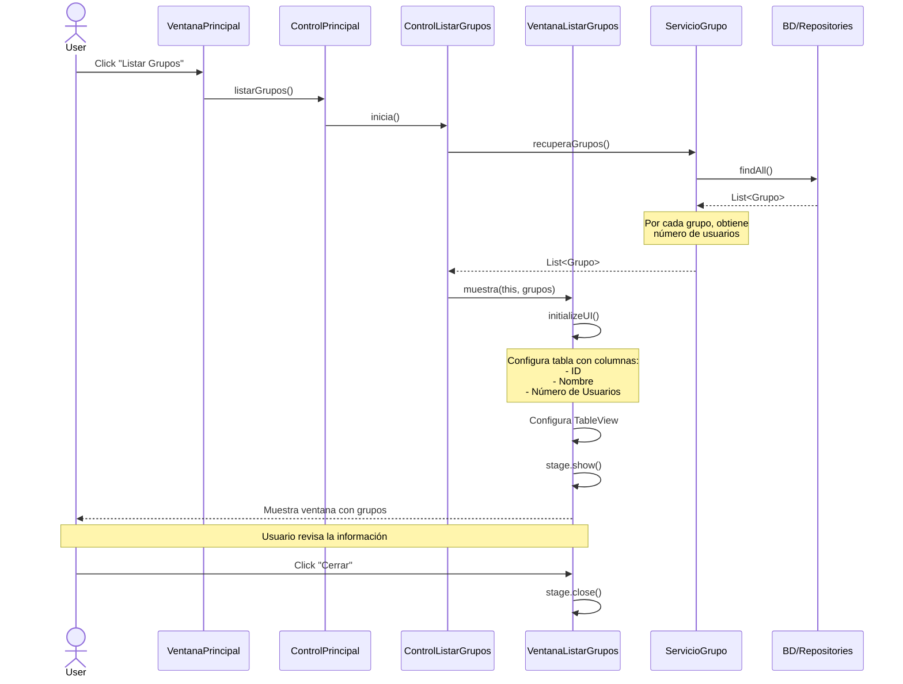

# Sequence Diagram: Listar Grupos Flow

Este diagrama de secuencia ilustra el flujo de interacciones que ocurren cuando un usuario hace clic en el botón "Listar Grupos" en la aplicación.

## Explicación de la Secuencia

1. **Inicio del Caso de Uso**:
   - El usuario hace clic en el botón "Listar Grupos" en la ventana principal
   - La solicitud se propaga desde VentanaPrincipal → ControlPrincipal → ControlListarGrupos

2. **Recuperación de Datos**:
   - ControlListarGrupos solicita la lista de grupos a ServicioGrupo
   - ServicioGrupo obtiene los datos del repositorio
   - Para cada grupo, se calcula el número de usuarios asociados

3. **Presentación de Datos**:
   - VentanaListarGrupos inicializa la interfaz de usuario
   - Se configura una tabla con columnas para:
     * ID del grupo
     * Nombre del grupo
     * Número de usuarios en el grupo
   - Se muestra la ventana con los datos

4. **Finalización**:
   - El usuario revisa la información presentada
   - Al hacer clic en "Cerrar", la ventana se cierra y el control vuelve a la ventana principal 