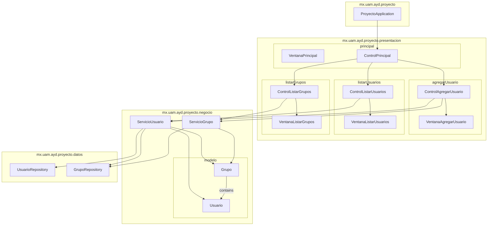

# Package Diagram: Estructura del Proyecto

Este diagrama muestra la estructura de paquetes del proyecto y sus relaciones.

## Descripción de la Arquitectura

La arquitectura del proyecto sigue un patrón de capas con una clara separación de responsabilidades:

1. **Capa de Presentación (`presentacion`)**:
   - Contiene las interfaces de usuario y controladores que manejan la interacción con el usuario
   - Se divide en módulos según las funcionalidades (principal, agregarUsuario, listarUsuarios, listarGrupos)
   - Cada módulo sigue el patrón MVC con una vista (Ventana) y un controlador (Control)

2. **Capa de Negocio (`negocio`)**:
   - Implementa la lógica de negocio a través de servicios
   - Los servicios coordinan operaciones y aplican reglas de negocio
   - Incluye el subpaquete `modelo` con las entidades del dominio

3. **Capa de Datos (`datos`)**:
   - Proporciona acceso a la persistencia de datos
   - Contiene repositorios que interactúan con la base de datos
   - Utiliza interfaces de Spring Data para operaciones CRUD

4. **Clase Principal (`ProyectoApplication`)**:
   - Punto de entrada de la aplicación
   - Coordina la inicialización de componentes y servicios
   - Configura la integración entre Spring Boot y JavaFX

## Interfaces de los Módulos

### 1. Capa de Presentación

#### 1.1 Módulo Principal

**ControlPrincipal**

| Método | Responsabilidad |
|--------|----------------|
| inicia() | Inicializa la aplicación y muestra la ventana principal |
| agregarUsuario() | Inicia el flujo de caso de uso para agregar un nuevo usuario |
| listarUsuarios() | Inicia el flujo de caso de uso para mostrar la lista de usuarios |
| listarGrupos() | Inicia el flujo de caso de uso para mostrar la lista de grupos |

**VentanaPrincipal**

| Método | Responsabilidad |
|--------|----------------|
| muestra(control) | Inicializa y muestra la ventana principal con sus botones y controles |

#### 1.2 Módulo Agregar Usuario

**ControlAgregarUsuario**

| Método | Responsabilidad |
|--------|----------------|
| inicia() | Inicia el proceso de agregar usuario, recuperando la lista de grupos disponibles |
| agregaUsuario(nombre, apellido, grupo) | Valida y procesa la creación de un nuevo usuario con los datos proporcionados |
| termina() | Finaliza el proceso y cierra la ventana de agregar usuario |

**VentanaAgregarUsuario**

| Método | Responsabilidad |
|--------|----------------|
| muestra(control, grupos) | Inicializa y muestra el formulario para agregar usuario con la lista de grupos disponibles |
| muestraDialogoConMensaje(mensaje) | Muestra un diálogo con un mensaje informativo o de error al usuario |
| setVisible(visible) | Controla la visibilidad de la ventana de agregar usuario |

#### 1.3 Módulo Listar Usuarios

**ControlListarUsuarios**

| Método | Responsabilidad |
|--------|----------------|
| inicia() | Recupera la lista de usuarios y muestra la ventana con los resultados |

**VentanaListarUsuarios**

| Método | Responsabilidad |
|--------|----------------|
| muestra(control, usuarios) | Muestra una tabla con la lista de usuarios y sus detalles |

#### 1.4 Módulo Listar Grupos

**ControlListarGrupos**

| Método | Responsabilidad |
|--------|----------------|
| inicia() | Recupera la lista de grupos y muestra la ventana con los resultados |

**VentanaListarGrupos**

| Método | Responsabilidad |
|--------|----------------|
| muestra(control, grupos) | Muestra una tabla con la lista de grupos y sus detalles |

### 2. Capa de Negocio

#### 2.1 Servicios

**ServicioUsuario**

| Método | Responsabilidad |
|--------|----------------|
| agregaUsuario(nombre, apellido, nombreGrupo) | Crea un nuevo usuario y lo asocia al grupo especificado, aplicando reglas de negocio |
| recuperaUsuarios() | Obtiene la lista completa de usuarios registrados en el sistema |

**ServicioGrupo**

| Método | Responsabilidad |
|--------|----------------|
| recuperaGrupos() | Obtiene la lista completa de grupos disponibles en el sistema |
| creaGrupo(nombre) | Crea un nuevo grupo con el nombre especificado, verificando que no exista previamente |

#### 2.2 Modelo

**Usuario**

| Método | Responsabilidad |
|--------|----------------|
| getIdUsuario() | Obtiene el identificador único del usuario |
| getNombre() | Obtiene el nombre del usuario |
| getApellido() | Obtiene el apellido del usuario |
| getEdad() | Obtiene la edad del usuario |
| setNombre(nombre) | Establece el nombre del usuario |
| setApellido(apellido) | Establece el apellido del usuario |
| setEdad(edad) | Establece la edad del usuario |

**Grupo**

| Método | Responsabilidad |
|--------|----------------|
| getIdGrupo() | Obtiene el identificador único del grupo |
| getNombre() | Obtiene el nombre del grupo |
| getUsuarios() | Obtiene la lista de usuarios pertenecientes al grupo |
| setNombre(nombre) | Establece el nombre del grupo |
| addUsuario(usuario) | Agrega un usuario al grupo, verificando que no exista previamente |
| removeUsuario(usuario) | Elimina un usuario del grupo si existe |

### 3. Capa de Datos

#### 3.1 Repositorios

**UsuarioRepository**

| Método | Responsabilidad |
|--------|----------------|
| findByNombreAndApellido(nombre, apellido) | Busca un usuario por su nombre y apellido |
| findByEdadBetween(edad1, edad2) | Encuentra usuarios cuya edad está en el rango especificado |
| save(usuario) | Guarda o actualiza un usuario en la base de datos |
| findAll() | Recupera todos los usuarios almacenados |
| deleteById(id) | Elimina un usuario por su identificador |

**GrupoRepository**

| Método | Responsabilidad |
|--------|----------------|
| findByNombre(nombre) | Busca un grupo por su nombre |
| save(grupo) | Guarda o actualiza un grupo en la base de datos |
| findAll() | Recupera todos los grupos almacenados |
| deleteById(id) | Elimina un grupo por su identificador |

## Notas sobre las Interfaces

1. **Principios de Diseño**:
   - Las interfaces siguen el principio de segregación de interfaces (ISP)
   - Cada interfaz define un contrato claro y específico
   - Se mantiene una alta cohesión y bajo acoplamiento

2. **Convenciones de Nombrado**:
   - Interfaces prefijadas con 'I'
   - Nombres descriptivos que reflejan su propósito
   - Métodos con nombres que indican acciones claras

3. **Gestión de Dependencias**:
   - Uso de inyección de dependencias vía Spring
   - Referencias a interfaces en lugar de implementaciones concretas
   - Manejo de ciclo de vida de componentes vía anotaciones Spring

4. **Patrones de Diseño Aplicados**:
   - Patrón MVC en la capa de presentación
   - Patrón Repository en la capa de datos
   - Patrón Service en la capa de negocio
   - Patrón Observer para la actualización de vistas

Esta arquitectura facilita la mantenibilidad y extensibilidad del código, permitiendo realizar cambios en una capa con impacto mínimo en las demás. 