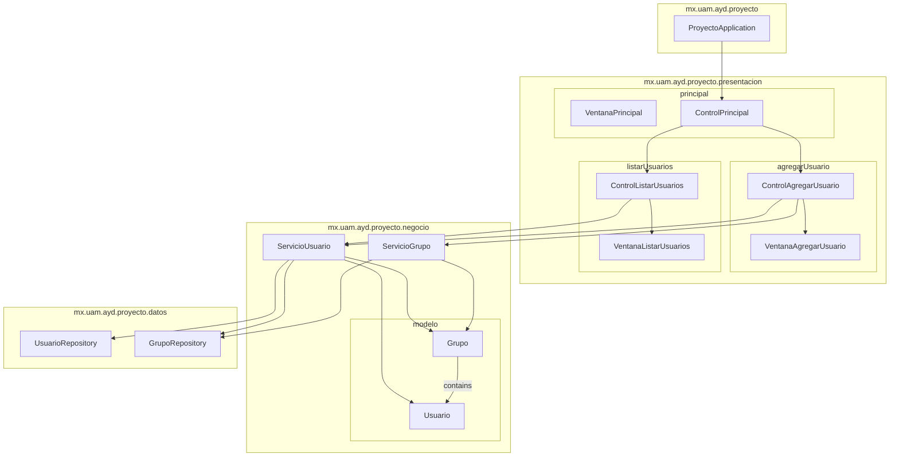

# Package Diagram: Estructura del Proyecto

Este diagrama muestra la estructura de paquetes del proyecto y sus relaciones.

## Descripción de la Arquitectura

La arquitectura del proyecto sigue un patrón de capas con una clara separación de responsabilidades:

1. **Capa de Presentación (`presentacion`)**:
   - Contiene las interfaces de usuario y controladores que manejan la interacción con el usuario
   - Se divide en módulos según las funcionalidades (principal, agregarUsuario, listarUsuarios)
   - Cada módulo sigue el patrón MVC con una vista (Ventana) y un controlador (Control)

2. **Capa de Negocio (`negocio`)**:
   - Implementa la lógica de negocio a través de servicios
   - Los servicios coordinan operaciones y aplican reglas de negocio
   - Incluye el subpaquete `modelo` con las entidades del dominio

3. **Capa de Datos (`datos`)**:
   - Proporciona acceso a la persistencia de datos
   - Contiene repositorios que interactúan con la base de datos
   - Utiliza interfaces de Spring Data para operaciones CRUD

4. **Clase Principal (`ProyectoApplication`)**:
   - Punto de entrada de la aplicación
   - Coordina la inicialización de componentes y servicios
   - Configura la integración entre Spring Boot y JavaFX

Esta arquitectura facilita la mantenibilidad y extensibilidad del código, permitiendo realizar cambios en una capa con impacto mínimo en las demás. 